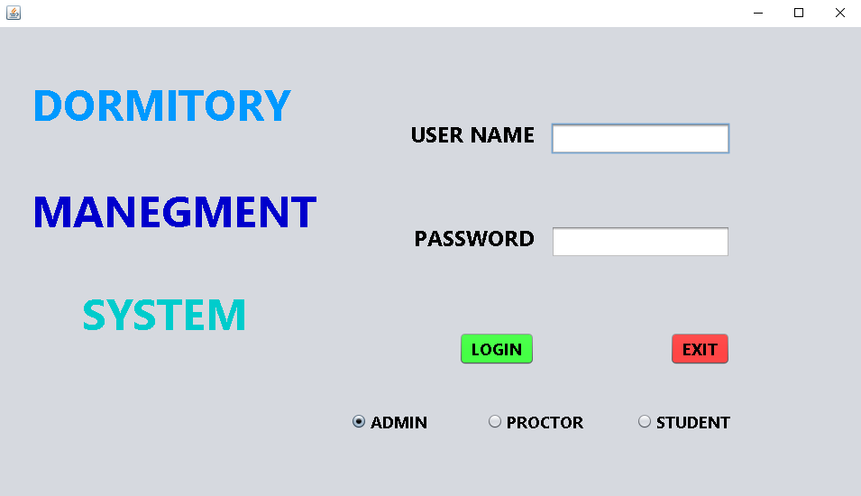
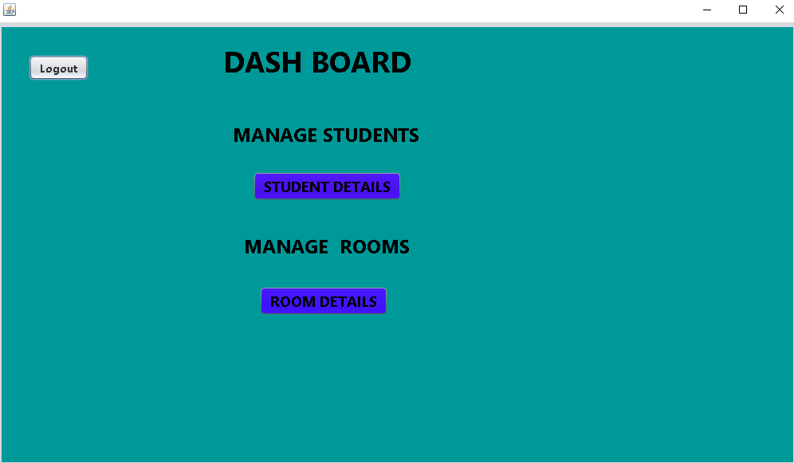
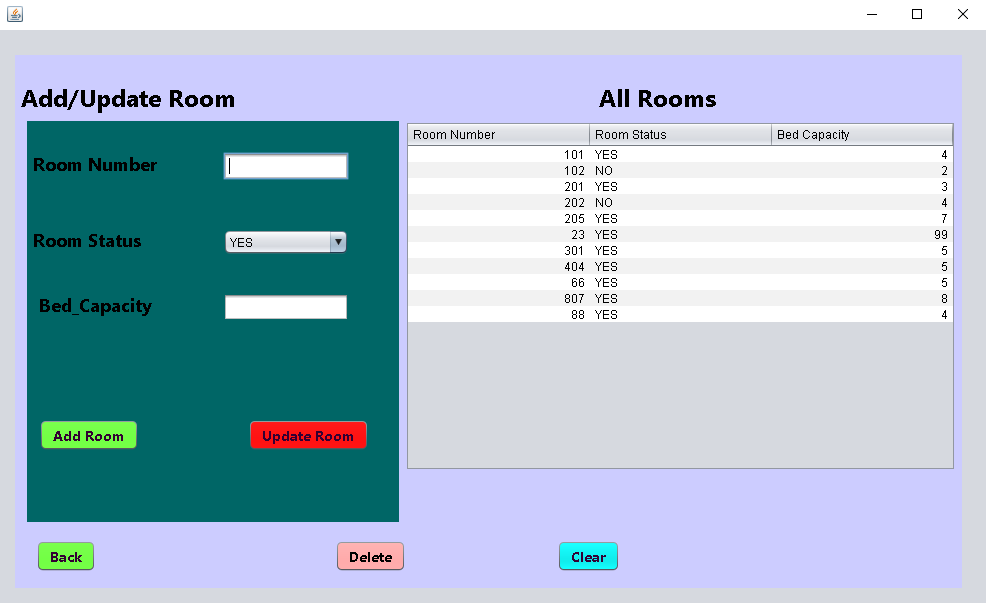
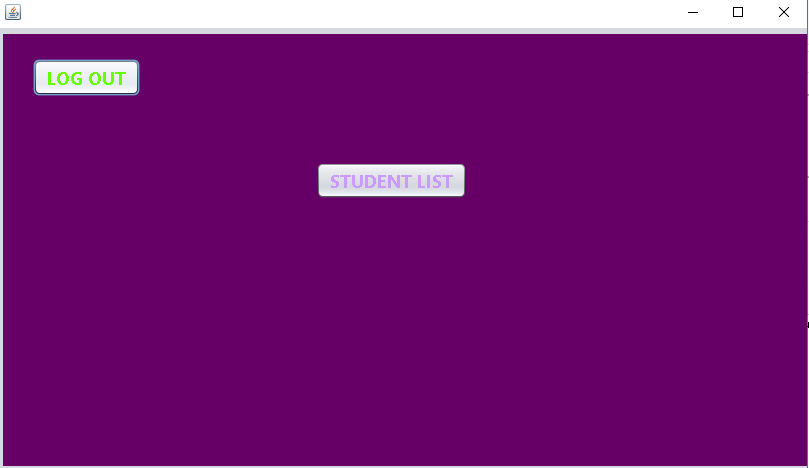
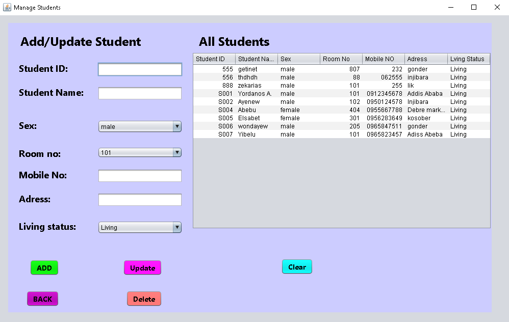
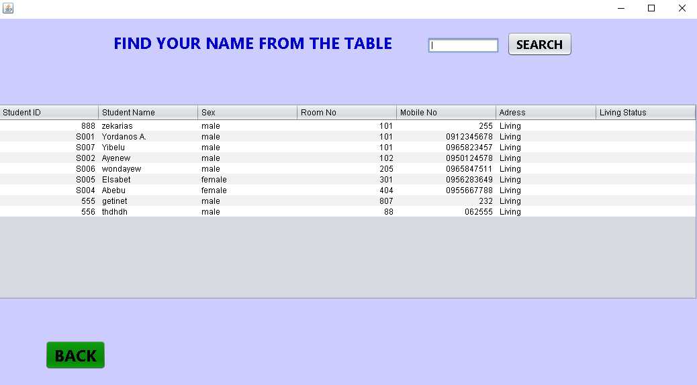
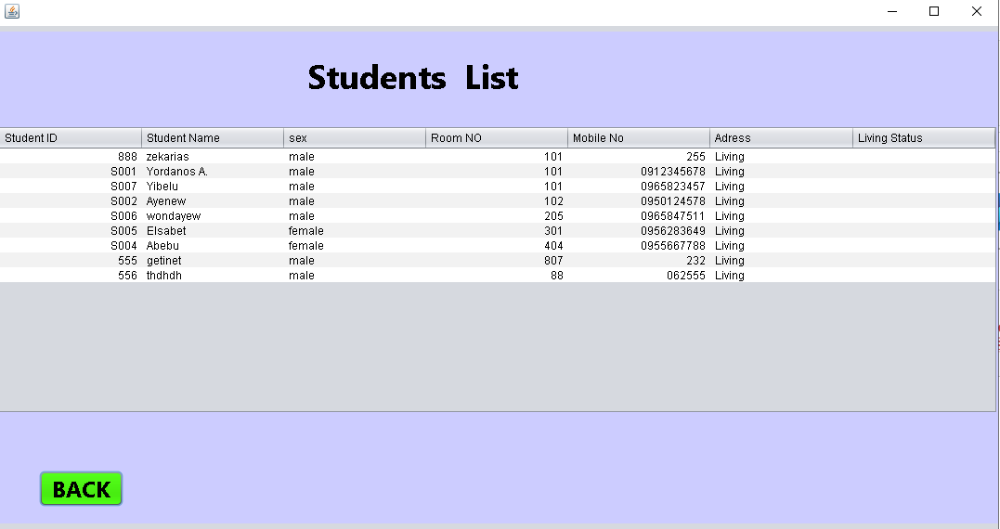

# Dormitory Management System 🏨
This is a desktop-based management system developed using **Java Swing** and **MySQL** database. It is designed to manage student information, room allocations, and proctor dashboards efficiently.

## ✨ Key Features
* **User Authentication:** Secure Login for administrators and proctors.
* **Student Management:** Register, update, and view student details.
* **Room Management:** Monitor room availability and assign students.
* **Dashboards:** Dedicated views for Proctors and Students.
* **Database Integration:** Reliable data storage using MySQL.

## 📸 System Screenshots
### 1. Login Page

### 2. Main Dashboard

### 3. Room Management

### 4. Proctor Dashboard

### 5. Student Details

### 6. Student Dashboard

### 7. Student List

## 🛠️ Built With
* **Language:** Java
* **IDE:** Apache NetBeans
* **GUI Library:** Java Swing
* **Database:** MySQL
* **Connector:** MySQL Connector/J 9.5.0

## 🚀 How to Run the Project
1. Clone this repository or download the ZIP file.
2. Import the `Dorm_DB.sql` file into your local MySQL database.
3. Open the project in **Apache NetBeans**.
4. Update the `ConnectionProvider.java` file with your MySQL username and password.
5. Run the `LoginFrame.java` file.

---
Developed by **Yordanos** - Injibara University.
